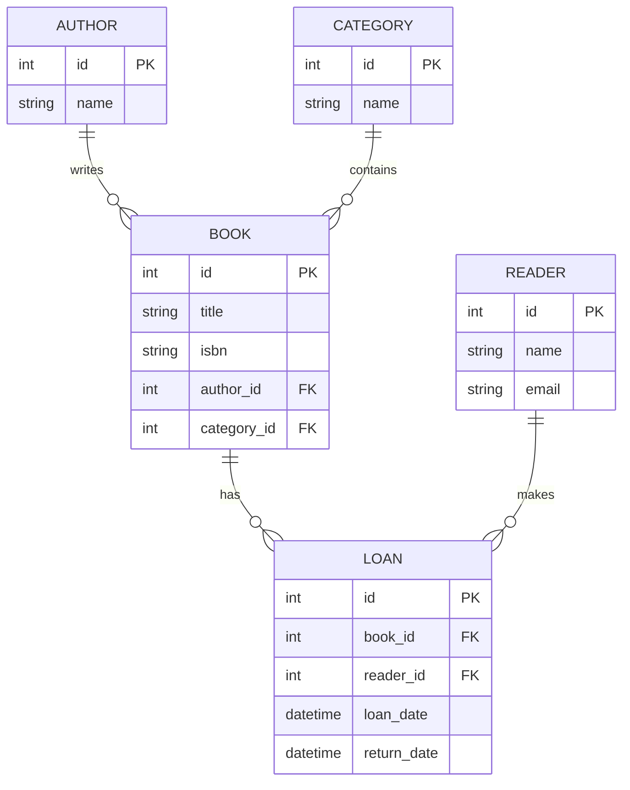

# Система управления библиотекой

Проект разработан в рамках лабораторной работы №3 по разработке структуры информационной системы.

## ER-диаграмма базы данных



## Структура проекта

Проект использует трехслойную архитектуру:

1. Data Access Layer (DAL)
   - models.py - определение моделей данных
   - database.py - настройка подключения к БД

2. Business Logic Layer (BLL)
   - library_service.py - бизнес-логика приложения

3. Presentation Layer (API)
   - endpoints.py - REST API endpoints

## Технологии

- Python 3.8+
- FastAPI - веб-фреймворк
- SQLAlchemy - ORM для работы с базой данных
- SQLite - база данных
- Pydantic - валидация данных

## Установка и запуск

1. Установить зависимости:
```bash
pip install -r requirements.txt
```

2. Запустить приложение:
```bash
python main.py
```

Приложение будет доступно по адресу: http://localhost:8000

## API Endpoints

- POST /books/ - добавить новую книгу
- POST /readers/ - зарегистрировать нового читателя
- POST /loans/ - оформить выдачу книги
- PUT /loans/{loan_id}/return - оформить возврат книги